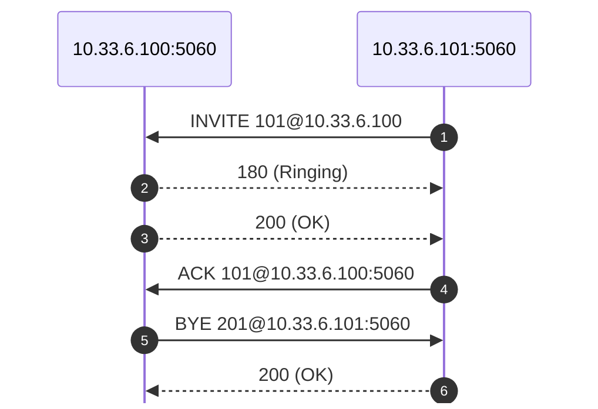

# pcap2mermaid

[](LICENSE)
[](https://www.python.org/)
[](https://github.com/secdev/scapy)

**pcap2mermaid** is a Python tool that converts SIP traffic from a PCAP capture into a [Mermaid](https://mermaid-js.github.io/mermaid/#/sequenceDiagram) sequence diagram, which you can use to visualize call flows.

This script is robust and feature-rich, supporting custom participant naming, SIP filtering, time annotation, summary tables, progress and error logging, and more.

---

## Features

- **SIP-over-UDP/TCP, IPv4/IPv6** supported
- **Custom participant naming** via mapping or CSV
- **Autonumbered diagrams** (Mermaid's `autonumber`)
- **SIP method/status filtering**
- **Timestamp annotations** (optional)
- **Summary mapping table** (optional)
- **Progress and dropped-packet logging**
- **Robust error handling**
- **Large file support**
- **Output to file or screen**: If you omit the output file argument, the diagram prints to your terminal (stdout).
- **Short or mapped participant names** (default: on; suppress with `--no-add-participants`)
- **SIP URI parameters (e.g. `;user=phone`) are omitted** from the sequence diagram for compatibility with Mermaid.
- **Participant boxes at the bottom are hidden by default** (`mirrorActors: false`); use `--show-bottom-actors` to reveal.
- **By default, only declares participants actually used in SIP messages** (diagram lines), **not all hosts/ports seen** (see below for `--all-participants`).

---

## Requirements

- Python 3.7+
- [scapy](https://pypi.org/project/scapy/) (`pip install scapy`)

---

## Usage

```sh
python3 pcap2mermaid.py input.pcap [output.md] [options]
```

- If `output.md` is omitted, the diagram is printed to the screen (stdout).

### Options

| Option                | Description                                                  |
|-----------------------|-------------------------------------------------------------|
| `--mapping`           | Comma-separated host:port=name (e.g. `1.2.3.4:5060=PBX,...`)|
| `--participant-names` | CSV file: `<ip>:<port>,name`                                |
| `--port`              | SIP port (default: 5060)                                    |
| `--no-add-participants`| Do **not** add `participant` lines (default: add)          |
| `--autonumber`        | Add Mermaid `autonumber` to sequence diagram                |
| `--filter-method`     | Comma-separated SIP methods to include (e.g. `INVITE,BYE`)  |
| `--filter-status`     | Comma-separated SIP status codes (e.g. `200,486`)           |
| `--add-time`          | Prepend timestamp to each message                           |
| `--summary-table`     | Output a participant mapping table at end of output         |
| `--no-skip-provisional`| Include provisional (<180) SIP responses                   |
| `--logfile`           | Write logs to a file                                        |
| `--verbose`           | Show debug/info log messages (default: quiet/error-only)    |
| `--all-participants`  | Declare all seen participants, even if not shown in diagram |
| `--show-bottom-actors`| Show actor boxes (participants) at the bottom (default: hide)|

---

## Default Behaviors

- **Participant lines**: Are included by default. Use `--no-add-participants` to suppress.
- **Mermaid bottom actors**: Hidden by default (i.e., `%%{init: { "sequence": { "mirrorActors": false } }}%%` at top). Use `--show-bottom-actors` to display.
- **Logging**: Only errors are shown by default. Use `--verbose` for info/debug logs.
- **Participants declared**: Only those actually involved in SIP messages are declared unless `--all-participants` is set.
- **Participant order**: By default, participants are ordered by their first appearance in the SIP flow, so the initiator is always leftmost and the flow is visually intuitive.

---

### Example

#### Output to screen

```sh
python3 pcap2mermaid.py calls.pcap
```

#### Output to file

```sh
python3 pcap2mermaid.py calls.pcap calls.md
```

#### With participant mapping

```sh
python3 pcap2mermaid.py calls.pcap calls.md --mapping "10.0.0.1:5060=PBX,10.0.0.2:5060=Phone"
```

#### With custom participant CSV

Create a `names.csv`:
```
10.0.0.1:5060,PBX
10.0.0.2:5060,Phone
```

Then run:
```sh
python3 pcap2mermaid.py calls.pcap calls.md --participant-names names.csv
```

#### Hide participant lines (no `participant ... as ...` lines):

```sh
python3 pcap2mermaid.py calls.pcap --no-add-participants
```

#### Show participant boxes at the bottom (Mermaid mirrorActors):

```sh
python3 pcap2mermaid.py calls.pcap --show-bottom-actors
```

#### Declare all seen participants:

```sh
python3 pcap2mermaid.py calls.pcap --all-participants
```

---

## Output Example

With default options, the output starts like:



---

## Acknowledgements

This tool was developed primarily by [GitHub Copilot](https://github.com/features/copilot), GitHub’s AI coding assistant.

---

## Tips

- For large PCAP files, consider filtering with `tcpdump` or Wireshark before processing.
- If you use participant mapping, you can easily change the participant names in the Mermaid file or use the summary table.
- Use `--summary-table` for quick mapping reference.
- If you encounter Mermaid parse errors, ensure your SIP URIs do not contain forbidden characters (the script omits parameters for you).

---

## License

[GNU General Public License v2.0 or later](LICENSE)

**Note:** This project uses [scapy](https://github.com/secdev/scapy), which is licensed under the GPL v2 or later. Therefore, this tool is also licensed under the GPL v2 or later.
