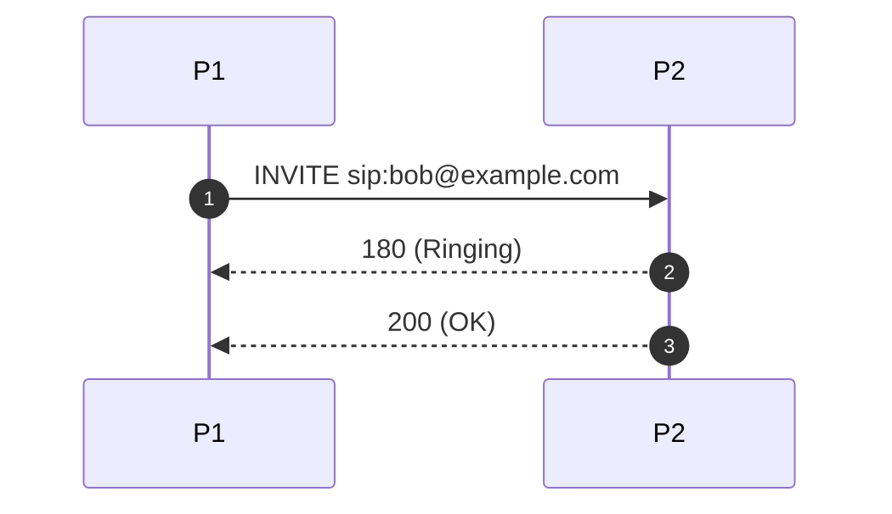

# pcap2mermaid

**pcap2mermaid** is a Python tool that converts SIP traffic from a PCAP capture into a [Mermaid](https://mermaid-js.github.io/mermaid/#/sequenceDiagram) sequence diagram, which you can use to visualize call flows.

This script is robust and feature-rich, supporting custom participant naming, SIP filtering, time annotation, summary tables, progress and error logging, and more.

---

## Features

- **SIP-over-UDP/TCP, IPv4/IPv6** supported
- **Custom participant naming** via mapping or CSV
- **Autonumbered diagrams** (Mermaid's `autonumber`)
- **SIP method/status filtering**
- **Timestamp annotations** (optional)
- **Summary mapping table** (optional)
- **Progress and dropped-packet logging**
- **Robust error handling**
- **Large file support**

---

## Requirements

- Python 3.7+
- [scapy](https://pypi.org/project/scapy/) (`pip install scapy`)

---

## Usage

```sh
python3 pcap2mermaid.py input.pcap output.md [options]
```

### Options

| Option                       | Description                                                    |
|------------------------------|----------------------------------------------------------------|
| `--mapping`                  | Comma-separated host:port=name (e.g. `1.2.3.4:5060=PBX,...`)   |
| `--participant-names`        | CSV file: `<ip>:<port>,name`                                   |
| `--port`                     | SIP port (default: 5060)                                       |
| `--add-participants`         | Add `participant` lines to diagram with default or mapped names |
| `--autonumber`               | Add Mermaid `autonumber` to sequence diagram                   |
| `--filter-method`            | Comma-separated SIP methods to include (e.g. `INVITE,BYE`)     |
| `--filter-status`            | Comma-separated SIP status codes (e.g. `200,486`)              |
| `--add-time`                 | Prepend timestamp to each message                              |
| `--summary-table`            | Output a participant mapping table at end of output            |
| `--no-skip-provisional`      | Include provisional (<180) SIP responses                       |
| `--logfile`                  | Write logs to a file                                           |
| `--verbose`                  | Show debug log messages                                        |

---

### Example

#### Basic usage

```sh
python3 pcap2mermaid.py calls.pcap calls.md --add-participants --autonumber
```

#### With participant mapping

```sh
python3 pcap2mermaid.py calls.pcap calls.md --mapping "10.0.0.1:5060=PBX,10.0.0.2:5060=Phone"
```

#### With custom participant CSV

Create a `names.csv`:
```
10.0.0.1:5060,PBX
10.0.0.2:5060,Phone
```

Then run:
```sh
python3 pcap2mermaid.py calls.pcap calls.md --participant-names names.csv --add-participants
```

#### With SIP method filtering and time annotation

```sh
python3 pcap2mermaid.py calls.pcap calls.md --filter-method INVITE,BYE --add-time
```

---

## Output Example

The output will look like:



You can paste this into [Mermaid Live Editor](https://mermaid-js.github.io/mermaid-live-editor/) or compatible markdown viewers.

---

## Tips

- For large PCAP files, consider filtering with `tcpdump` or Wireshark before processing.
- If you use `--add-participants`, you can easily change the participant names in the Mermaid file.
- Use `--summary-table` for quick mapping reference.

---

## License

MIT

---
